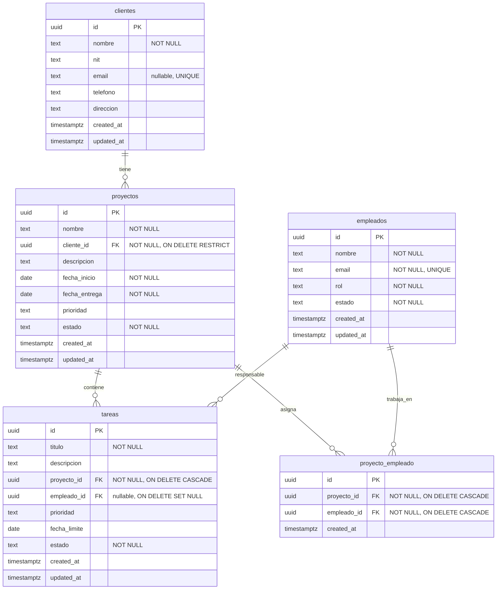

# Diseño de Base de Datos — MiniERP (AGENTIQ)

---

## 1. Objetivo del modelo de datos

El modelo de datos debe soportar los 5 módulos del sistema (Inicio, Clientes, Proyectos, Tareas, Empleados) garantizando:

- **Integridad referencial** entre todas las entidades del negocio.
- **KPIs del dashboard** mediante consultas agregadas (conteo de proyectos por estado, tareas vencidas, etc.).
- **Cronograma Gantt** mediante fechas de inicio y entrega de proyectos.
- **Tablero Kanban** mediante estado de tareas y su asignación a empleados.
- **Carga de trabajo** mediante la relación entre empleados, proyectos y tareas.

El modelo sigue la arquitectura definida en `docs/02-architecture.md`: acceso exclusivo desde servidor, sin autenticación, con validación en tres niveles.

---

## 2. Entidades principales

### 2.1. Clientes (`clientes`)

| Aspecto | Detalle |
|---|---|
| **Propósito** | Almacena los datos de clientes de AGENTIQ. Cada proyecto debe pertenecer a un cliente. |
| **Identificador principal** | `id` (UUID) |
| **Atributos** | `id`, `nombre`, `nit`, `email`, `telefono`, `direccion`, `created_at`, `updated_at` |
| **Tipo de dato conceptual** | Tabla maestra. |

| Campo | Tipo | Obligatorio | Único | Origen |
|---|---|---|---|---|
| `id` | UUID (PK) | Sí | Sí | Generado |
| `nombre` | TEXT | Sí | No | RF-09 |
| `nit` | TEXT | No | No | RF-10 |
| `email` | TEXT | No | Sí (permite NULLs múltiples) | RF-11 |
| `telefono` | TEXT | No | No | RF-12 |
| `direccion` | TEXT | No | No | RF-13 |

**Decisión S-12 sobre `email`:** El correo es opcional en clientes. Si se proporciona, debe ser único. PostgreSQL permite múltiples valores NULL dentro de una restricción UNIQUE, por lo que varios clientes pueden quedar sin email registrado.

**Normalización de correos:** Todos los correos se almacenarán en minúsculas y sin espacios al inicio o final (trim + lowercase) tanto en `clientes.email` como en `empleados.email`. La normalización se aplica en la capa de validación Zod antes de llegar a la base de datos.

### 2.2. Empleados (`empleados`)

| Aspecto | Detalle |
|---|---|
| **Propósito** | Almacena los miembros del equipo de AGENTIQ. Los empleados se asignan a proyectos y tareas. |
| **Identificador principal** | `id` (UUID) |
| **Atributos** | `id`, `nombre`, `email`, `rol`, `estado`, `created_at`, `updated_at` |
| **Tipo de dato conceptual** | Tabla maestra. |

| Campo | Tipo | Obligatorio | Único | Origen |
|---|---|---|---|---|
| `id` | UUID (PK) | Sí | Sí | Generado |
| `nombre` | TEXT | Sí | No | RF-45 |
| `email` | TEXT | Sí | Sí | RF-46 |
| `rol` | TEXT | Sí | No | RF-47 |
| `estado` | TEXT | Sí | No | RF-48 |

**Nota sobre `rol`:** El brief sugiere valores (Desarrollador, Diseñador, Project Manager, QA) pero no define si es catálogo fijo o texto libre. **Supuesto S-09:** se implementa como texto libre para permitir roles personalizados.

**Nota sobre `estado`:** Valores permitidos: `Activo`, `Inactivo`. Fuente: RF-48.

### 2.3. Proyectos (`proyectos`)

| Aspecto | Detalle |
|---|---|
| **Propósito** | Es la entidad central del sistema. Almacena cada proyecto de software gestionado para un cliente. |
| **Identificador principal** | `id` (UUID) |
| **Atributos** | `id`, `nombre`, `cliente_id`, `descripcion`, `fecha_inicio`, `fecha_entrega`, `prioridad`, `estado`, `created_at`, `updated_at` |
| **Tipo de dato conceptual** | Tabla de negocio. Depende de `clientes`. |

| Campo | Tipo | Obligatorio | Único | Origen |
|---|---|---|---|---|
| `id` | UUID (PK) | Sí | Sí | Generado |
| `nombre` | TEXT | Sí | No | RF-18 |
| `cliente_id` | UUID (FK) | Sí | No | RF-19 |
| `descripcion` | TEXT | No | No | RF-20 |
| `fecha_inicio` | DATE | Sí | No | RF-21 |
| `fecha_entrega` | DATE | Sí | No | RF-22 |
| `prioridad` | TEXT | No | No | RF-23 |
| `estado` | TEXT | Sí | No | RF-24 |

**Prioridad:** Valores permitidos: `Baja`, `Media`, `Alta`. Campo opcional según RF-23.

### 2.4. Tareas (`tareas`)

| Aspecto | Detalle |
|---|---|
| **Propósito** | Almacena las tareas operativas dentro de cada proyecto. |
| **Identificador principal** | `id` (UUID) |
| **Atributos** | `id`, `titulo`, `descripcion`, `proyecto_id`, `empleado_id`, `prioridad`, `fecha_limite`, `estado`, `created_at`, `updated_at` |
| **Tipo de dato conceptual** | Tabla de negocio. Depende de `proyectos` y `empleados`. |

| Campo | Tipo | Obligatorio | Único | Origen |
|---|---|---|---|---|
| `id` | UUID (PK) | Sí | Sí | Generado |
| `titulo` | TEXT | Sí | No | RF-34 |
| `descripcion` | TEXT | No | No | RF-35 |
| `proyecto_id` | UUID (FK) | Sí | No | RF-36 |
| `empleado_id` | UUID (FK) | No | No | RF-37 (S-15) |
| `prioridad` | TEXT | No | No | RF-38 |
| `fecha_limite` | DATE | No | No | RF-39 |
| `estado` | TEXT | Sí | No | RF-40 |

**Decisión S-15 sobre `empleado_id`:** El empleado asignado a una tarea es opcional. Una tarea puede crearse sin responsable y asignarse posteriormente. Cuando se asigna, debe cumplir RN-08 (empleado debe estar previamente asignado al proyecto). La FK `tareas.empleado_id` → `empleados.id` usa `ON DELETE SET NULL` (ver sección 7.3).

### 2.5. Tabla intermedia: proyecto\_empleado (`proyecto_empleado`)

| Aspecto | Detalle |
|---|---|
| **Propósito** | Tabla puente para la relación muchos-a-muchos entre proyectos y empleados. |
| **Identificador principal** | `id` (UUID) o PK compuesta (`proyecto_id`, `empleado_id`) |
| **Atributos** | `id`, `proyecto_id`, `empleado_id`, `created_at` |
| **Tipo de dato conceptual** | Tabla asociativa. Depende de `proyectos` y `empleados`. |

| Campo | Tipo | Obligatorio | Único | Origen |
|---|---|---|---|---|
| `id` | UUID (PK) | Sí | Sí | Generado |
| `proyecto_id` | UUID (FK) | Sí | No | RF-25 |
| `empleado_id` | UUID (FK) | Sí | No | RF-25 |

**Restricción de unicidad:** El par (`proyecto_id`, `empleado_id`) debe ser único para evitar asignaciones duplicadas.

---

## 3. Relaciones y cardinalidades

### 3.1. Cliente → Proyectos

| Aspecto | Detalle |
|---|---|
| **Cardinalidad** | 1 cliente → N proyectos (uno a muchos) |
| **Obligatoriedad** | Un proyecto debe pertenecer a un cliente (FK `cliente_id` NOT NULL). Un cliente puede tener 0 o más proyectos. |
| **Descripción** | Cada proyecto es ejecutado para un cliente. Si un cliente se elimina, debe verificarse que no tenga proyectos asociados antes de permitir la eliminación. |
| **Tabla intermedia** | No aplica. |

### 3.2. Proyecto → Tareas

| Aspecto | Detalle |
|---|---|
| **Cardinalidad** | 1 proyecto → N tareas (uno a muchos) |
| **Obligatoriedad** | Una tarea debe pertenecer a un proyecto (FK `proyecto_id` NOT NULL). Un proyecto puede tener 0 o más tareas. |
| **Descripción** | Las tareas son el desglose operativo del proyecto. |
| **Tabla intermedia** | No aplica. |

### 3.3. Proyecto ↔ Empleados

| Aspecto | Detalle |
|---|---|
| **Cardinalidad** | N proyectos ↔ M empleados (muchos a muchos) |
| **Obligatoriedad** | Un proyecto puede tener 0 o más empleados asignados. Un empleado puede estar en 0 o más proyectos. |
| **Descripción** | Los empleados se asignan a proyectos mediante selección múltiple en el formulario de proyecto. Esta relación permite consultar "¿en qué proyectos participa este empleado?" y "¿qué empleados trabajan en este proyecto?". |
| **Tabla intermedia** | `proyecto_empleado` (ver sección 2.5) |

### 3.4. Empleado → Tareas

| Aspecto | Detalle |
|---|---|
| **Cardinalidad** | 1 empleado → N tareas (uno a muchos) |
| **Obligatoriedad** | Una tarea puede no tener empleado asignado (FK `empleado_id` nullable). Un empleado puede tener 0 o más tareas. |
| **Descripción** | Cada tarea es responsabilidad de un solo empleado (supuesto S-04). Si el empleado se elimina, la tarea conserva su registro con `empleado_id = NULL` (SET NULL). |
| **Tabla intermedia** | No aplica. |

---

## 4. Relaciones muchos a muchos

### 4.1. Proyectos y empleados — Requiere tabla intermedia

**Decisión:** Sí, se requiere la tabla `proyecto_empleado`.

**Justificación:** El brief (RF-25) especifica "Empleados asignados (selección múltiple de empleados ya registrados en el módulo de Empleados)". El supuesto S-03 confirma que "Un empleado puede estar en múltiples proyectos". La relación es muchos-a-muchos, lo que exige una tabla puente.

**Uso desde la aplicación:**
- Al crear/editar un proyecto, se insertan/eliminan registros en `proyecto_empleado` según los empleados seleccionados.
- Al consultar empleados de un proyecto: `SELECT empleados JOIN proyecto_empleado WHERE proyecto_id = ?`.
- Al consultar proyectos de un empleado: `SELECT proyectos JOIN proyecto_empleado WHERE empleado_id = ?`.

### 4.2. Tareas y empleados — No requiere tabla intermedia

**Decisión:** No se requiere tabla intermedia.

**Justificación:** El brief (RF-37) especifica "Empleado asignado" en singular. El supuesto S-04 confirma que "una tarea tiene un solo empleado asignado". La relación es uno-a-muchos (1 empleado → N tareas), resuelta con una FK `empleado_id` en la tabla `tareas`.

---

## 5. Estados permitidos

### 5.1. Proyectos

| Estado | Origen | Descripción |
|---|---|---|
| `Planeado` | RF-24 / RF-26 | Estado inicial. Proyecto creado sin tareas activas. |
| `En progreso` | RF-26 / RF-27 | Tiene al menos una tarea en estado "En progreso". Puede marcarse manualmente o de forma automática. |
| `Completado` | RF-26 / RF-28 | Todas las tareas están en estado "Completada". Puede marcarse manualmente. |

**Decisión sobre almacenamiento:** El estado se almacena como TEXT en la columna `estado` de la tabla `proyectos`. No se requiere tabla de catálogo para 3 valores fijos. La validación se realiza mediante constraint CHECK o Zod en la capa de aplicación.

### 5.2. Tareas

| Estado | Origen | Descripción |
|---|---|---|
| `Pendiente` | RF-40 | Estado inicial. Creada pero sin trabajo iniciado. |
| `En progreso` | RF-40 | Trabajo en curso. |
| `Completada` | RF-40 | Trabajo finalizado. |

**Decisión sobre almacenamiento:** Misma estrategia que proyectos: TEXT con validación vía CHECK o Zod.

### 5.3. Empleados

| Estado | Origen | Descripción |
|---|---|---|
| `Activo` | RF-48 | Disponible para asignación a proyectos. |
| `Inactivo` | RF-48 | No disponible. Se conserva su historial. |

**Decisión sobre almacenamiento:** TEXT con validación.

### 5.4. Distinción: estado explícito vs supuesto

| Estado | Tipo | Evidencia |
|---|---|---|
| Proyecto: `Planeado`, `En progreso`, `Completado` | Explícito | RF-26, tabla en sección 6.3 del brief |
| Tarea: `Pendiente`, `En progreso`, `Completada` | Explícito | RF-40, tabla en sección 6.4 del brief |
| Empleado: `Activo`, `Inactivo` | Explícito | RF-48 |
| Prioridad: `Baja`, `Media`, `Alta` | Explícito | RF-23, RF-38 |
| Rol de empleado: valores sugeridos | Supuesto (S-09) | El brief sugiere valores pero no define catálogo fijo |

---

## 6. Reglas de negocio

### 6.1. Reglas de integridad referencial

| ID | Regla | Tipo | Origen |
|---|---|---|---|
| RN-01 | Un proyecto debe pertenecer a un cliente existente | FK `proyectos.cliente_id` → `clientes.id` | RF-19 |
| RN-02 | Una tarea debe pertenecer a un proyecto existente | FK `tareas.proyecto_id` → `proyectos.id` | RF-36 |
| RN-03 | Un empleado asignado a una tarea debe existir en `empleados` | FK `tareas.empleado_id` → `empleados.id` | RF-37 |
| RN-04 | Un empleado asignado a un proyecto debe existir en `empleados` | FK `proyecto_empleado.empleado_id` → `empleados.id` | RF-25 |
| RN-05 | Un proyecto referenciado en `proyecto_empleado` debe existir | FK `proyecto_empleado.proyecto_id` → `proyectos.id` | RF-25 |

### 6.2. Reglas de fechas

| ID | Regla | Tipo | Origen |
|---|---|---|---|
| RN-06 | `fecha_entrega` debe ser posterior a `fecha_inicio` en proyectos | CHECK o validación Zod | RF-22 |
| RN-07 | `fecha_limite` debe ser posterior o igual a la fecha de creación de la tarea | Validación Zod | Supuesto (regla de sentido común) |

### 6.3. Reglas de asignación

| ID | Regla | Tipo | Origen |
|---|---|---|---|
| RN-08 | Un empleado asignado a una tarea debe estar previamente asignado al proyecto de esa tarea | **Regla de negocio** (no constraint FK directa) | RF-37 / RNF-29 |
| RN-09 | Un proyecto puede tener 0 o más empleados asignados | Sin restricción de mínimo | RNF-26 menciona "proyecto sin empleados asignados" como caso borde válido |

**Nota sobre RN-08:** Esta regla no puede enforced mediante una FK simple porque cruza tres tablas (tareas → proyecto_empleado → empleados). Se implementa en la capa de aplicación:
1. Al asignar un empleado a una tarea, se verifica que exista un registro en `proyecto_empleado` con el mismo `proyecto_id` y `empleado_id`.
2. Si no existe, la asignación es rechazada.

### 6.4. Reglas de cambio de estado

| ID | Regla | Origen |
|---|---|---|
| RN-10 | Proyecto: `Planeado` → `En progreso` (automático al crear primera tarea activa) | RF-27 |
| RN-11 | Proyecto: `En progreso` → `Completado` (automático si todas las tareas están "Completada", o manual) | RF-28 |
| RN-12 | Tarea: `Pendiente` → `En progreso` → `Completada` (flujo lineal) | RF-41 |
| RN-13 | No se permiten saltos de estado hacia atrás (ej: `Completada` → `Pendiente`) | Supuesto por sentido de negocio |

### 6.5. Campos obligatorios

Tabla resumen de campos obligatorios vs opcionales según el brief:

| Entidad | Obligatorios | Opcionales |
|---|---|---|
| Clientes | `nombre`, `email` | `nit`, `telefono`, `direccion` |
| Proyectos | `nombre`, `cliente_id`, `fecha_inicio`, `fecha_entrega`, `estado` | `descripcion`, `prioridad` |
| Tareas | `titulo`, `proyecto_id`, `estado` | `descripcion`, `empleado_id`, `prioridad`, `fecha_limite` |
| Empleados | `nombre`, `email`, `rol`, `estado` | Ninguno |

### 6.6. Campos únicos

| Entidad | Campo único | Origen |
|---|---|---|
| Clientes | `email` (nullable, permite múltiples NULL) | S-12: único cuando tiene valor |
| Empleados | `email` | RF-46 (correo, implícitamente único por lógica de negocio) |
| proyecto_empleado | (`proyecto_id`, `empleado_id`) | Evitar asignaciones duplicadas |

---

## 7. Estrategia de eliminación

### 7.1. Cliente con proyectos

| Aspecto | Detalle |
|---|---|
| **Regla del brief** | "Validar que, si tiene proyectos asociados, se avise antes de eliminar" (RF-16) |
| **Estrategia** | `ON DELETE RESTRICT` en la FK `proyectos.cliente_id`. |
| **Comportamiento** | Si el cliente tiene proyectos, la base de datos rechaza la eliminación. La aplicación captura el error y muestra el mensaje de advertencia al usuario. |
| **Justificación** | El brief exige una advertencia, no un bloqueo forzado. RESTRICT en BD es la red de seguridad; la aplicación proporciona la experiencia de usuario (mensaje claro, sugerencia de acción). |

### 7.2. Proyecto con tareas

| Aspecto | Detalle |
|---|---|
| **Regla del brief** | Aprobado S-10: eliminación en cascada. |
| **Estrategia** | `ON DELETE CASCADE` en `tareas.proyecto_id` y `proyecto_empleado.proyecto_id`. |
| **Comportamiento** | Al eliminar un proyecto, se eliminan automáticamente todas sus tareas y registros de asignación de empleados. La aplicación debe solicitar confirmación explícita e informar que también se eliminarán las tareas y asignaciones asociadas. |
| **Justificación** | Las tareas y las asignaciones proyecto-empleado no tienen sentido sin el proyecto principal. CASCADE evita que queden registros huérfanos. |

### 7.3. Empleado asignado

| Aspecto | Detalle |
|---|---|
| **Regla del brief** | No especifica restricciones para eliminar empleados. S-10 aprobado: SET NULL en tareas, CASCADE en proyecto_empleado. |
| **Estrategia** | `ON DELETE SET NULL` en `tareas.empleado_id` y `ON DELETE CASCADE` en `proyecto_empleado.empleado_id`. |
| **Comportamiento** | Al eliminar un empleado: (a) las tareas que tenía asignadas quedan con `empleado_id = NULL` (sin responsable), conservando el registro histórico de la tarea; (b) las asignaciones del empleado a proyectos se eliminan en cascada. |
| **Justificación** | **SET NULL en tareas:** si `empleado_id` fuera RESTRICT, no se podría eliminar un empleado con tareas asociadas, obligando a reasignarlas una por una. Con SET NULL las tareas se conservan sin responsable, lo que permite reasignarlas después. El campo es nullable por S-15. **CASCADE en proyecto_empleado:** la asignación proyecto-empleado deja de tener sentido si el empleado ya no existe. |

### 7.4. Tarea

| Aspecto | Detalle |
|---|---|
| **Regla del brief** | "Editar y eliminar tareas" (RF-44). Sin restricciones adicionales. |
| **Estrategia** | Eliminación directa. Ninguna entidad depende de tareas. |
| **Comportamiento** | DELETE directo. No afecta a otras entidades. |

### 7.5. Resumen de eliminación

| Eliminación de | FK en tabla dependiente | Acción ON DELETE | Validación en aplicación |
|---|---|---|---|
| Cliente | `proyectos.cliente_id` | `RESTRICT` | Mostrar advertencia con proyectos asociados |
| Proyecto | `tareas.proyecto_id` | `CASCADE` | Confirmación explícita informando que se eliminarán tareas y asignaciones |
| Proyecto | `proyecto_empleado.proyecto_id` | `CASCADE` | (misma confirmación que arriba) |
| Empleado | `tareas.empleado_id` | `SET NULL` | Las tareas quedan sin responsable |
| Empleado | `proyecto_empleado.empleado_id` | `CASCADE` | Las asignaciones a proyectos se eliminan |
| Tarea | Ninguna | — | Eliminación directa |

---

## 8. Convenciones de base de datos

### 8.1. Nombres de tablas

- Plural en snake_case. Ej: `clientes`, `proyectos`, `tareas`, `empleados`, `proyecto_empleado`.
- Tablas intermedias: concatenación de las dos tablas en singular separadas por guion bajo. Ej: `proyecto_empleado`.

### 8.2. Columnas

- snake_case. Ej: `fecha_inicio`, `cliente_id`, `created_at`.
- Las FK se nombran como `{tabla_referencia_en_singular}_id`. Ej: `cliente_id`, `proyecto_id`.
- Evitar prefijos redundantes (no `cli_nombre`, solo `nombre`).

### 8.3. Primary keys

- Tipo UUID v4 generado por la base de datos (`gen_random_uuid()`).
- Nombre `id` en todas las tablas.

### 8.4. Foreign keys

- Nombre explícito: `fk_{tabla_origen}_{columna}`.
- Ejemplo: `fk_tareas_proyecto_id`, `fk_tareas_empleado_id`.
- Especificar `ON DELETE` según la estrategia de la sección 7.

### 8.5. Índices

- Crear índice para cada FK (ver sección 10).
- Los nombres de índice: `idx_{tabla}_{columna}`. Ej: `idx_tareas_proyecto_id`.

### 8.6. Constraints

| Tipo | Nombre | Ejemplo |
|---|---|---|
| Primary key | `pk_{tabla}` | `pk_clientes` |
| Foreign key | `fk_{tabla}_{columna}` | `fk_tareas_proyecto_id` |
| Unique | `uq_{tabla}_{columna(s)}` | `uq_clientes_email` |
| Check | `ck_{tabla}_{columna}` | `ck_proyectos_estado` |

### 8.7. Timestamps

- `created_at`: TIMESTAMPTZ, NOT NULL, DEFAULT `now()`.
- `updated_at`: TIMESTAMPTZ, NOT NULL, DEFAULT `now()`.
- `deleted_at`: No se implementa (sin eliminación lógica en este alcance).

---

## 9. Auditoría básica

### 9.1. `created_at`

| Aspecto | Detalle |
|---|---|
| **Uso** | Registrar cuándo se creó cada registro. |
| **Tablas** | Todas las tablas. |
| **Justificación** | Permite ordenar por fecha de creación, auditar cuándo se registró un cliente o se creó una tarea. Sin esta columna no sería posible implementar KPIs como "proyectos del mes actual". |
| **Tipo** | `TIMESTAMPTZ` con `DEFAULT now()`. No nulo. |

### 9.2. `updated_at`

| Aspecto | Detalle |
|---|---|
| **Uso** | Registrar la última modificación de cada registro. |
| **Tablas** | Todas las tablas. |
| **Justificación** | Permite saber cuándo fue la última actualización. Se actualiza automáticamente mediante un trigger o desde la aplicación. |
| **Tipo** | `TIMESTAMPTZ` con `DEFAULT now()`. No nulo. |

### 9.3. `deleted_at`

| Aspecto | Detalle |
|---|---|
| **Uso** | Soft delete. |
| **Decisión** | **No se implementa.** El brief no requiere eliminación lógica. La estrategia de eliminación es física con verificación previa (sección 7). |
| **Justificación** | El supuesto S-05 indica: "No se requiere historial de cambios ni log de actividades". Agregar `deleted_at` sin necesidad es sobreingeniería para este alcance. |

---

## 10. Índices conceptuales

### 10.1. Índices por FK (relaciones)

| Tabla | Columna | Tipo de índice | Justificación |
|---|---|---|---|
| `proyectos` | `cliente_id` | B-tree | JOIN con `clientes` en vista de detalle de cliente y listado de proyectos |
| `tareas` | `proyecto_id` | B-tree | JOIN con `proyectos` para listar tareas de un proyecto, cálculo de % de avance |
| `tareas` | `empleado_id` | B-tree | JOIN con `empleados` para vista de carga de trabajo |
| `proyecto_empleado` | `proyecto_id` | B-tree | JOIN para listar empleados de un proyecto |
| `proyecto_empleado` | `empleado_id` | B-tree | JOIN para listar proyectos de un empleado |

### 10.2. Índices por estado (filtros)

| Tabla | Columna | Tipo de índice | Justificación |
|---|---|---|---|
| `proyectos` | `estado` | B-tree | Filtro en listado de proyectos, KPI de proyectos activos/completados |
| `tareas` | `estado` | B-tree | Filtro en tablero Kanban, KPI de tareas pendientes |

### 10.3. Índices por fechas (ordenamiento y Gantt)

| Tabla | Columna | Tipo de índice | Justificación |
|---|---|---|---|
| `proyectos` | `fecha_inicio` | B-tree | Ordenamiento en cronograma Gantt |
| `proyectos` | `fecha_entrega` | B-tree | Ordenamiento en cronograma Gantt |
| `tareas` | `fecha_limite` | B-tree | KPI de tareas vencidas, listado de próximos vencimientos |

### 10.4. Índices por búsqueda

| Tabla | Columna(s) | Tipo de índice | Justificación |
|---|---|---|---|
| `clientes` | `nombre` | B-tree (o trigram para búsqueda parcial) | Buscador por nombre (RF-15) |
| `empleados` | `rol` | B-tree | Filtro por rol (RF-50) |
| `empleados` | `estado` | B-tree | Filtro por estado (RF-50) |

### 10.5. Índices compuestos

| Tabla | Columnas | Justificación |
|---|---|---|
| `proyecto_empleado` | (`proyecto_id`, `empleado_id`) | PK compuesta o unique constraint. Consultas frecuentes por ambas columnas. |
| `tareas` | (`proyecto_id`, `estado`) | Tablero Kanban: filtrar tareas por proyecto y agrupar por estado |

**Nota:** No se escriben sentencias SQL. Estos índices se crearán en el script de migración correspondiente.

---

## 11. Diagrama ERD



### Leyenda de cardinalidades

| Símbolo | Significado |
|---|---|
| `||--o{` | Uno (obligatorio) a muchos (opcional) |
| `||--|{` | Uno (obligatorio) a muchos (obligatorio) |
| `o{` | Cero o muchos |

---

## 12. Datos semilla

Conjunto de datos coherente para demostrar el sistema. No se escriben sentencias INSERT.

### 12.1. Clientes

| # | Nombre | NIT | Email | Teléfono |
|---|---|---|---|---|
| 1 | TechCorp S.A. | 123456789-0 | contacto@techcorp.com | +57 300 111 2233 |
| 2 | InnovaSoft Ltda. | 987654321-0 | info@innovasoft.co | +57 310 444 5566 |
| 3 | GlobalBank | 456789123-0 | proyectos@globalbank.com | +57 320 777 8899 |
| 4 | GreenEnergy SAS | — | ops@greenenergy.io | — |

### 12.2. Empleados

| # | Nombre | Email | Rol | Estado |
|---|---|---|---|---|
| 1 | Carlos Méndez | carlos@agentiq.com | Desarrollador | Activo |
| 2 | Ana Velasco | ana@agentiq.com | Diseñadora | Activo |
| 3 | Pedro Ruiz | pedro@agentiq.com | Project Manager | Activo |
| 4 | Laura Gómez | laura@agentiq.com | QA | Activo |
| 5 | Sergio Mora | sergio@agentiq.com | Desarrollador | Activo |
| 6 | Diana Reyes | diana@agentiq.com | Desarrollador | Inactivo |

### 12.3. Proyectos

| # | Nombre | Cliente | Inicio | Entrega | Prioridad | Estado |
|---|---|---|---|---|---|---|
| 1 | Portal Web TechCorp | TechCorp S.A. | 2026-01-15 | 2026-04-15 | Alta | En progreso |
| 2 | App Móvil InnovaSoft | InnovaSoft Ltda. | 2026-02-01 | 2026-06-30 | Media | Planeado |
| 3 | Core Banking GlobalBank | GlobalBank | 2025-10-01 | 2026-03-01 | Alta | En progreso |
| 4 | Dashboard GreenEnergy | GreenEnergy SAS | 2026-03-01 | 2026-05-15 | Baja | Planeado |
| 5 | Rediseño Web InnovaSoft | InnovaSoft Ltda. | 2025-08-01 | 2025-12-15 | Media | Completado |

### 12.4. Asignaciones proyecto_empleado

| Proyecto | Empleados asignados |
|---|---|
| Portal Web TechCorp | Carlos Méndez, Ana Velasco, Laura Gómez |
| App Móvil InnovaSoft | Sergio Mora, Ana Velasco |
| Core Banking GlobalBank | Carlos Méndez, Pedro Ruiz |
| Dashboard GreenEnergy | Sergio Mora |
| Rediseño Web InnovaSoft | Ana Velasco, Pedro Ruiz, Laura Gómez |

### 12.5. Tareas

Estado variado: algunas Pendiente, otras En progreso, otras Completadas. Incluir al menos una tarea vencida (fecha límite anterior a la fecha actual) y una tarea sin fecha límite.

| # | Título | Proyecto | Empleado | Prioridad | Fecha límite | Estado |
|---|---|---|---|---|---|---|
| 1 | Diseñar mockups del portal | Portal Web TechCorp | Ana Velasco | Alta | 2026-02-01 | Completada |
| 2 | Maquetar landing page | Portal Web TechCorp | Carlos Méndez | Alta | 2026-02-20 | En progreso |
| 3 | Configurar CI/CD | Portal Web TechCorp | Carlos Méndez | Media | — | Pendiente |
| 4 | Pruebas de humo portal | Portal Web TechCorp | Laura Gómez | Alta | 2026-03-15 | Pendiente |
| 5 | Definir arquitectura app | App Móvil InnovaSoft | Sergio Mora | Alta | 2026-02-28 | Pendiente |
| 6 | Diseñar onboarding | App Móvil InnovaSoft | Ana Velasco | Media | 2026-04-01 | Pendiente |
| 7 | Migrar base de datos | Core Banking GlobalBank | Carlos Méndez | Alta | 2026-01-15 | Completada |
| 8 | Implementar API REST | Core Banking GlobalBank | Carlos Méndez | Alta | 2026-02-28 | En progreso |
| 9 | Auditoría de seguridad | Core Banking GlobalBank | Pedro Ruiz | Alta | 2026-03-10 | Pendiente |
| 10 | Corregir bug en login | Core Banking GlobalBank | Carlos Méndez | Media | 2025-12-01 | Completada |
| 11 | Diseñar dashboard | Dashboard GreenEnergy | Sergio Mora | Baja | 2026-04-30 | Pendiente |
| 12 | Actualizar estilos web | Rediseño Web InnovaSoft | Ana Velasco | Media | 2025-10-15 | Completada |
| 13 | QA del rediseño | Rediseño Web InnovaSoft | Laura Gómez | Media | 2025-12-01 | Completada |

### 12.6. KPIs resultantes con estos datos

| KPI | Valor esperado |
|---|---|
| Proyectos activos (En progreso) | 2 |
| Proyectos completados | 1 |
| Tareas pendientes (Pendiente + En progreso) | 8 |
| Tareas vencidas | — (ninguna en este conjunto) |
| Clientes activos (con proyecto vigente) | 3 |
| Empleados activos | 5 |

---

## 13. Riesgos del modelo

| ID | Riesgo | Probabilidad | Impacto | Mitigación |
|---|---|---|---|---|
| RD-01 | **Email duplicado en clientes o empleados** | Baja | Alto (violación de constraint) | Índice UNIQUE en `clientes.email` y `empleados.email`. Validación Zod en servidor antes del insert. |
| RD-02 | **Fechas inválidas en proyectos** (entrega anterior a inicio) | Media | Alto (datos inconsistentes) | Constraint CHECK en BD + validación Zod en servidor. Ambos niveles. |
| RD-03 | **Asignación inconsistente** (tarea asignada a empleado no asignado al proyecto) | Media | Medio (violación de regla de negocio) | Validación en la capa de aplicación: verificar existencia en `proyecto_empleado` antes de asignar tarea. Sin constraint en BD. |
| RD-04 | **Eliminación accidental de cliente con proyectos** | Baja | Alto (pérdida de datos) | `ON DELETE RESTRICT` en FK + verificación en aplicación con `409 Conflict`. |
| RD-05 | **Estado inconsistente** (proyecto "Completado" con tareas pendientes) | Media | Medio (engaña al KPI) | Regla de negocio en aplicación: al completar proyecto manualmente, verificar que todas las tareas estén completadas o marcarlas automáticamente. |
| RD-06 | **Proyecto sin empleados** | Alta | Bajo (es válido según RNF-26) | No se requiere mitigación. Es un caso válido. La UI debe manejarlo. |
| RD-07 | **Tarea sin fecha límite** | Alta | Bajo (es válido según RF-39) | La columna `fecha_limite` es nullable. Las tareas sin fecha no aparecen en "tareas vencidas" ni en "próximos vencimientos". |
| RD-08 | **Duplicación de asignación proyecto-empleado** | Baja | Bajo (sin impacto grave) | Unique constraint en (`proyecto_id`, `empleado_id`) en `proyecto_empleado`. |

---

## 14. Decisiones bloqueantes y supuestos

### 14.1. Decisiones confirmadas por el brief

| Decisión | Evidencia |
|---|---|
| 4 entidades principales: clientes, proyectos, tareas, empleados | Secciones 6.2 a 6.5 del brief |
| Relación M:N entre proyectos y empleados | RF-25 + S-03 |
| Relación 1:N entre cliente y proyectos | RF-19 |
| Relación 1:N entre proyecto y tareas | RF-36 |
| Relación 1:N entre empleado y tareas | RF-37 (singular) + S-04 |
| Estados de proyecto: Planeado, En progreso, Completado | RF-26 |
| Estados de tarea: Pendiente, En progreso, Completada | RF-40 |
| Estados de empleado: Activo, Inactivo | RF-48 |
| No hay autenticación obligatoria | Sección 6.6 del brief |
| No hay eliminación lógica | S-05 |

### 14.2. Decisiones aprobadas (ya no son bloqueantes)

| ID | Decisión | Confirmación |
|---|---|---|
| S-10 | Proyecto → Tareas: ON DELETE CASCADE. Proyecto → proyecto_empleado: ON DELETE CASCADE. | Aprobado |
| S-12 | `empleados.email`: NOT NULL + UNIQUE. `clientes.email`: nullable + UNIQUE (permite múltiples NULL). Normalización: lowercase + trim. | Aprobado |
| S-13 | Estados almacenados como TEXT con validación Zod/CHECK. Sin tabla de catálogo. | Aprobado |
| S-14 | Fechas almacenadas como DATE sin zona horaria. | Aprobado (S-06) |
| S-15 | Empleados no obligatorios al crear proyecto. `tareas.empleado_id` nullable. | Aprobado |

### 14.3. Supuestos pendientes por validar

| ID | Supuesto | Impacto en SQL |
|---|---|---|
| S-11 | Los empleados inactivos se conservan en la BD (no se eliminan físicamente) | No requiere cambios en el modelo |
| S-16 | Eliminación física de tareas (sin soft delete) | `DELETE` directo |

### 14.4. Preguntas que afectarían el SQL posterior

| # | Pregunta | Afecta a |
|---|---|---|
| 1 | ¿Debe haber un catálogo fijo de roles de empleado o es texto libre? | Tabla `roles` adicional o validación Zod |
| 2 | ¿Debe haber un catálogo fijo de prioridades o es texto libre? | Tabla `prioridades` o validación Zod |
| 3 | ¿La prioridad debe tener valor por defecto? | Default en columna |
| 4 | ¿Un proyecto puede moverse de "Completado" a "En progreso"? | Regla de negocio, no afecta modelo |
| 5 | ¿Se requiere almacenar quién creó/modificó cada registro? | Columnas `creado_por`, `modificado_por` |
| 6 | ¿La fecha límite de tarea debe ser obligatoria? | Cambiar nullable a NOT NULL |

---

## Resumen de entidades y relaciones propuestas

**5 tablas en total:**

| Tabla | Tipo | Registros semilla |
|---|---|---|
| `clientes` | Maestra | 4 |
| `empleados` | Maestra | 6 |
| `proyectos` | De negocio | 5 |
| `tareas` | De negocio | 13 |
| `proyecto_empleado` | Asociativa | 11 asignaciones |

**Relaciones:**

```
clientes 1──N proyectos
proyectos 1──N tareas
empleados 1──N tareas
proyectos N──M empleados (vía proyecto_empleado)
```

**Decisiones bloqueantes:** No quedan decisiones bloqueantes. Todos los supuestos críticos (S-10, S-12, S-13, S-14, S-15) han sido resueltos. El modelo está listo para la generación del SQL de migración.

---

## 15. Validaciones confirmadas

| # | Validación | Estado | Dónde se define |
|---|---|---|---|
| 1 | `tareas.empleado_id` solo puede referenciar empleados existentes | ✅ Confirmado | FK `fk_tareas_empleado_id` → `empleados.id` | 
| 2 | No se puede duplicar la misma relación proyecto-empleado | ✅ Confirmado | Unique constraint `uq_proyecto_empleado_pair` sobre (`proyecto_id`, `empleado_id`) en tabla `proyecto_empleado` |
| 3 | `proyecto_empleado` tiene restricción única compuesta por `proyecto_id` + `empleado_id` | ✅ Confirmado | Ver punto 2 |
| 4 | `fecha_entrega` no puede ser anterior a `fecha_inicio` en proyectos | ✅ Confirmado | CHECK constraint `ck_proyectos_fechas` + validación Zod en aplicación |
| 5 | Consistencia entre ERD, atributos y reglas de negocio | ✅ Verificado | Todas las relaciones, FKs y acciones ON DELETE coinciden en secciones 2, 3, 6, 7 y 11 |
| 6 | Los supuestos resueltos (S-10, S-12, S-13, S-14, S-15) ya no aparecen como bloqueantes | ✅ Verificado | Sección 14.2 documenta las decisiones aprobadas. Sección 14.1 actualizada |

---

*Documento generado como parte del diseño de base de datos — 21/07/2026*
